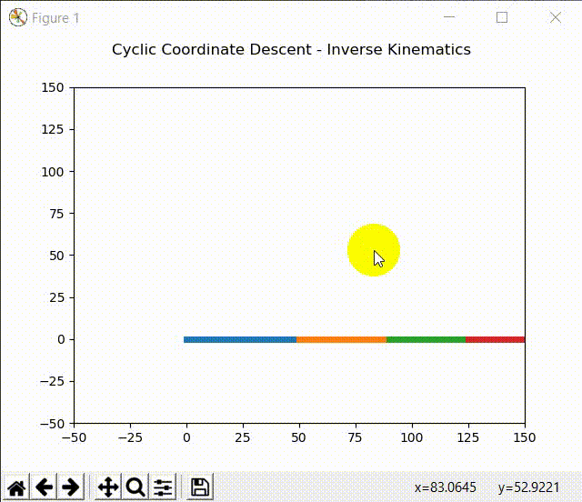

# CCD-Inverse-Kinematics-2D

Cyclic Coordinate Descent Inverse Kinematics of n-Link Arm Robot in 2D Space with Python and Matplotlib.

Question : eko.rudiawan@gmail.com

## Animation



## Requirement

1. Python 3
2. Numpy
3. Matplotlib

## How to Change Total Link and Length of the Link

```python
# Example robot link parameter
# Total link = 4
# Length link_0 = 50
# Length link_1 = 40
# Length link_2 = 35
# Length link_3 = 30
link = [50, 40, 35, 30]
```
